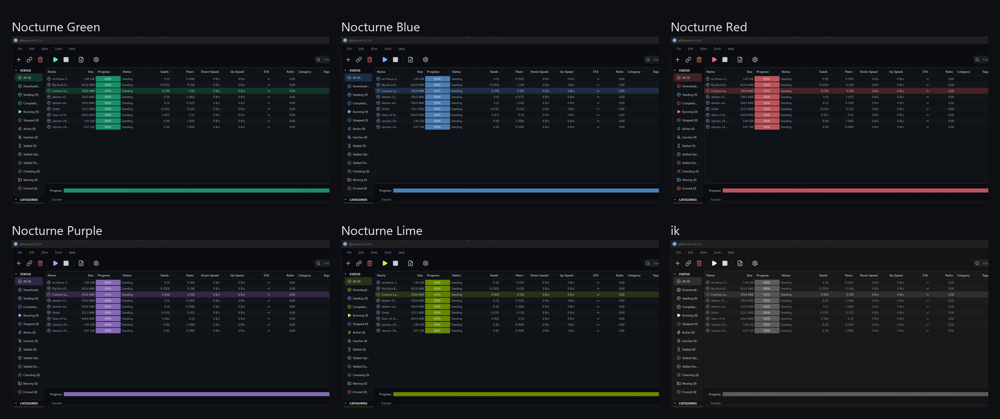
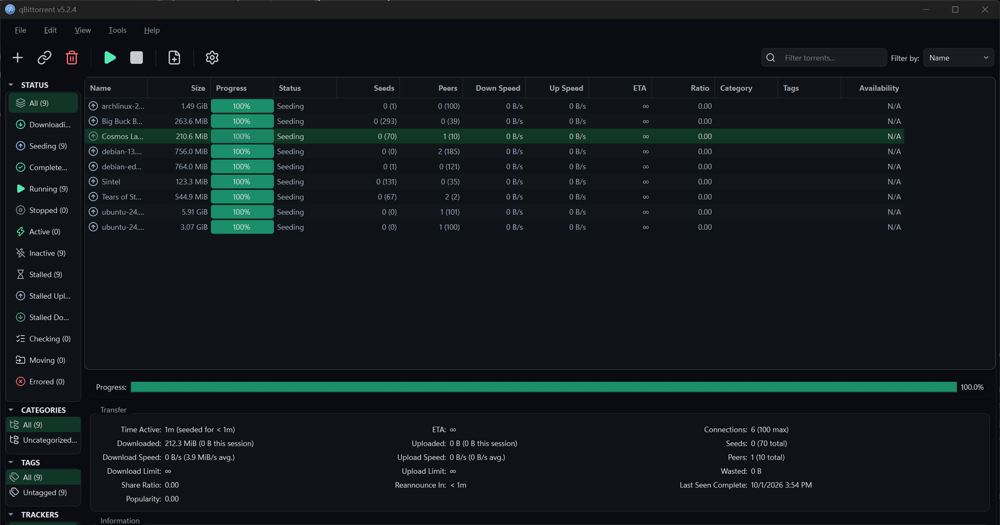
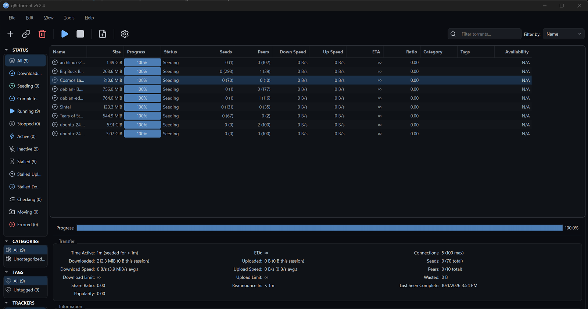
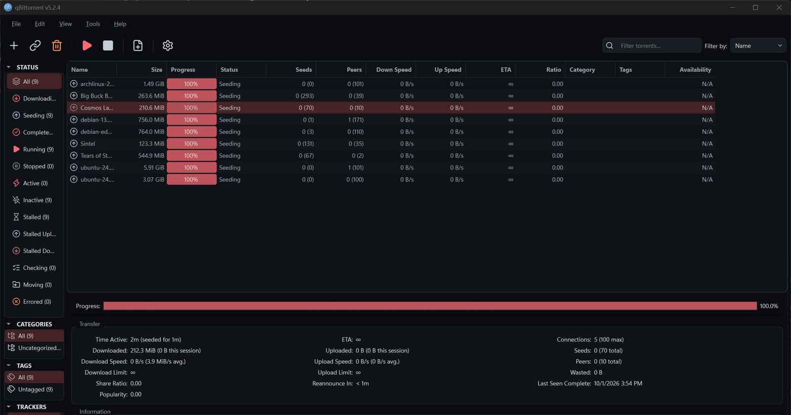
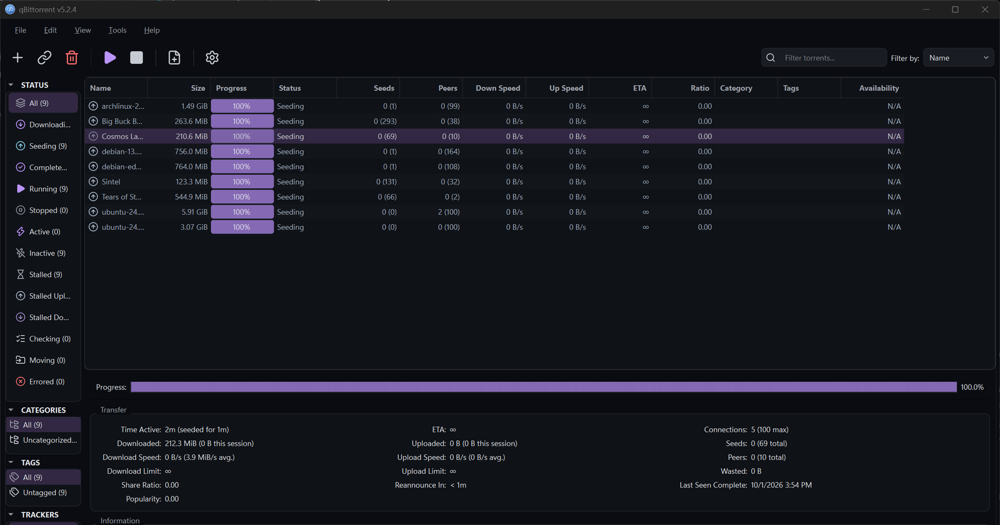
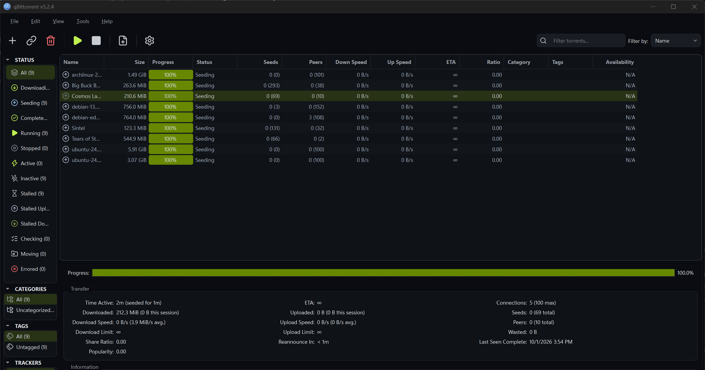
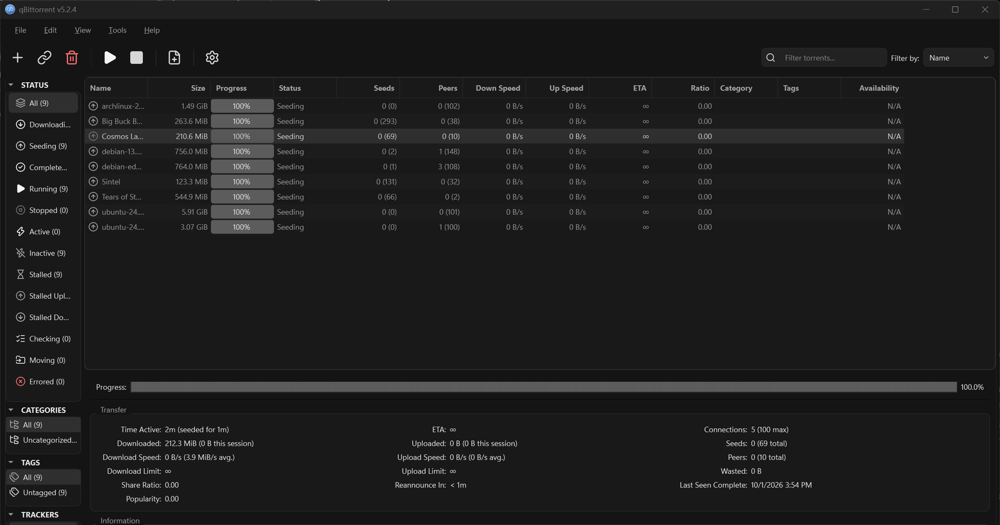

# qb-themes

Dark themes for the qBittorrent desktop app, each with a matching set of 88 line icons.



There are two families:

- **Nocturne**: blue-black graphite with one accent color, in five variants: green, blue, red, purple and lime.
- **ik**: flat monochrome on `#141414`. Only brightness separates active from idle; color is kept for warnings and errors.

Each theme styles the whole app: menus, toolbar, torrent list, sidebar, properties panel, Options dialog, scrollbars, tabs, checkboxes and tooltips. Torrents that are actually moving data are bright, while idle seeds stay quiet, so a long list stays readable.

Tested on qBittorrent 5.2.4 on Windows 11. They should work on any qBittorrent 4.6 or later built with Qt 6, on any OS.

## The themes

| Theme | Accent | File |
| --- | --- | --- |
| Nocturne Green | `#52e9b2` mint | [`nocturne-green.qbtheme`](dist/nocturne-green.qbtheme) |
| Nocturne Blue | `#71b5ff` | [`nocturne-blue.qbtheme`](dist/nocturne-blue.qbtheme) |
| Nocturne Red | `#f86974` rose | [`nocturne-red.qbtheme`](dist/nocturne-red.qbtheme) |
| Nocturne Purple | `#ba93fb` | [`nocturne-purple.qbtheme`](dist/nocturne-purple.qbtheme) |
| Nocturne Lime | `#bef050` | [`nocturne-lime.qbtheme`](dist/nocturne-lime.qbtheme) |
| ik | `#f5f5f5` on `#141414` | [`ik.qbtheme`](dist/ik.qbtheme) |

In Nocturne Red, errors are shown in orange so they don't blend into the accent.

<details>
<summary>Full-size screenshots</summary>

**Nocturne Green**


**Nocturne Blue**


**Nocturne Red**


**Nocturne Purple**


**Nocturne Lime**


**ik**


</details>

## Install

1. Download a `.qbtheme` file from [`dist/`](dist/) and keep it somewhere permanent. qBittorrent reads it on every start.
2. In qBittorrent, open **Tools → Options → Behavior**.
3. Tick **Use custom UI Theme** and pick the `.qbtheme` file.
4. Set **Style** to **Fusion** and **Color scheme** to **Dark** on the same page. Qt stylesheets render reliably on Fusion; the native Windows 11 style draws over parts of them.
5. Restart qBittorrent.

To switch back, untick **Use custom UI Theme** and restart.

### Or from the command line (Windows)

Clone the repo, quit qBittorrent with **File → Exit**, then run:

```sh
python apply.py nocturne-blue     # or any theme name from the table
python apply.py --revert          # restore your previous settings
```

`apply.py` backs up `%APPDATA%\qBittorrent\qBittorrent.ini` the first time you run it. It changes four settings: the theme on/off switch, the theme path, the style (Fusion) and the color scheme (Dark).

## Make your own variant

Every color comes from one token file per theme in [`themes/`](themes/). Colors are written in OKLCH, so lightness stays even across hues, and `build.py` converts them to hex for Qt.

A Nocturne variant only needs an accent and a seeding color. The darker accent shades are derived automatically:

```json
{ "name": "Nocturne Teal", "extends": "_nocturne-base",
  "tokens": { "accent": "oklch(82% 0.12 195)", "seed": "oklch(80% 0.085 255)" } }
```

Then build:

```sh
pip install PySide6-Essentials   # provides Qt's rcc, which packs the .qbtheme
python build.py                  # all themes -> dist/
python build.py nocturne-teal    # just one
```

What's where:

| Path | What it is |
| --- | --- |
| `themes/*.json` | Color tokens for each theme. |
| `src/stylesheet.template.qss` | The shared Qt stylesheet, with `{{token}}` placeholders. |
| `build.py` | Fills in the tokens, recolors the icons, writes `config.json` (qBittorrent's palette and status colors) and packs everything into `dist/<theme>.qbtheme`. Icon mapping is the `ICONS` table at the top. |
| `apply.py` | Turns a theme on or off on Windows. |

## Credits

Icons are from [Lucide](https://lucide.dev) (ISC license), recolored per theme. The screenshots were taken with Linux ISOs and Blender open films.

## License

[MIT](LICENSE). Lucide icons remain under the ISC license; see [LICENSE](LICENSE).
